# Classification d’images à l'aide d'algorithmes de Deep Learning

## Parcours OpenClassrooms Ingénieur Machine Learning
Projet 6 – novembre 2021
Julien Gremillot

# Le projet

* Le but de ce projet est d’obtenir un algorithme capable de classer des images en fonction de la race du chien présent sur l'image\.
* Les données à disposition sont le «[Stanford Dogs Dataset](http://vision.stanford.edu/aditya86/ImageNetDogs/)»
  * 120 races dechiens
  * Environ ~150 images par race
  * Nombretotald’images: 20 580

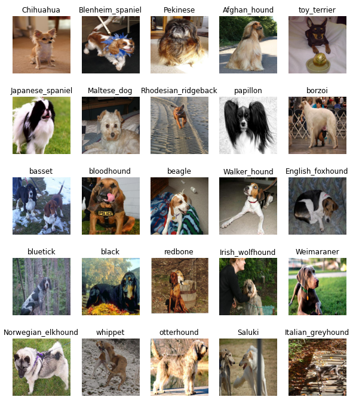

# Les données

* Récupération des données
  * 741 Mo d’images
* Division en jeux train / valid :
  * 80% \(16 464 images\) pour entrainement
  * 20% \(4 116 images\) pour la validation
* Uniformisation des tailles au format 224 x 224 pixels

# Mon réseau CNN

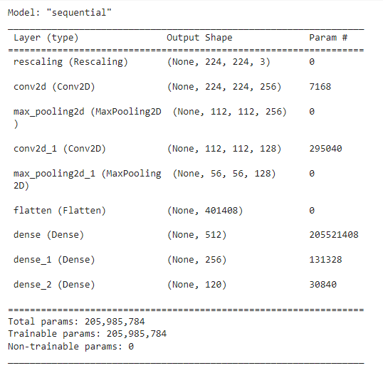

* En m’inspirant du réseau VGG étudié en cours\, j’ai assemblé un CNN composé des couches suivantes :
  * Rescaling
  * Convolution \+ MaxPooling \(x2\)
  * Flatten
  * Dense \(x2\)
  * Dense avec 120 sorties

# Premiers résultats

* Entrainement du CNN sur 10 epochs
* Premiers résultats très mauvais :
  * L’accuracy est très faible – quasiment 1/120
  * Les valeurs de loss sont hautes et ne varient pas – le modèle n’apprend rien

# Réduction de la complexité

12 races \(10%\)

L’accuracy est meilleure\, mais entre 1/10 et 1/12…

La valeur de loss est réduite

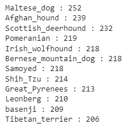

# Augmentation de données

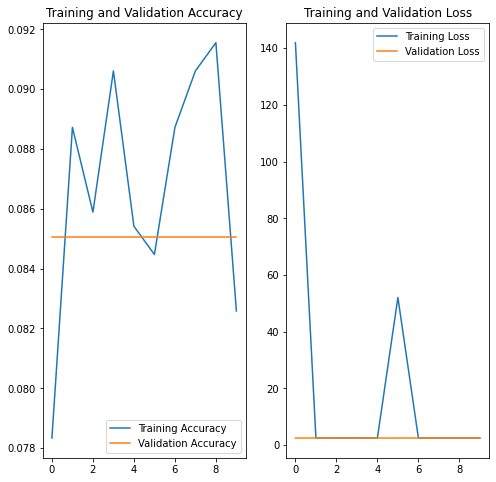

symétrie

rotation aléatoire

zoom aléatoire

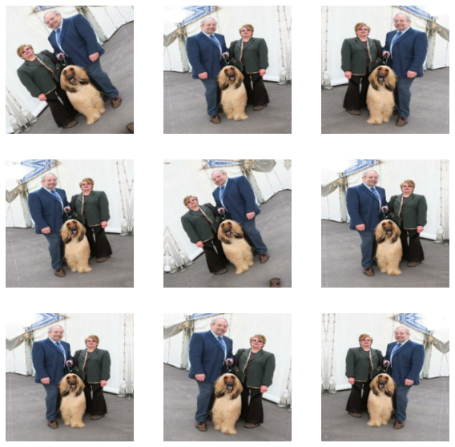

* Ajout :
  * Translation aléatoire
  * Contraste aléatoire

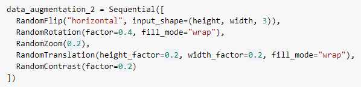

# Passage des images en noir et blanc

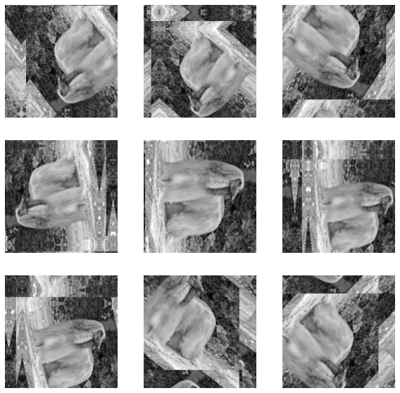

# Optimisation des hyper-paramètres

Utilisation de Keras Tuner

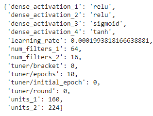

# Entrainement avec les hyper-paramètres

# Entrainement sur les 120 races

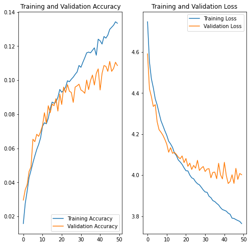

Avec les mêmes hyper\-paramètres sur le jeu de données initial

11% d’accuracy sur le jeu de validation avec 120 races

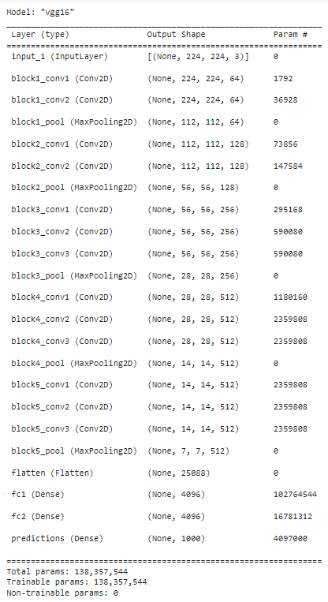

# Comparaison avec modèle VGG-16

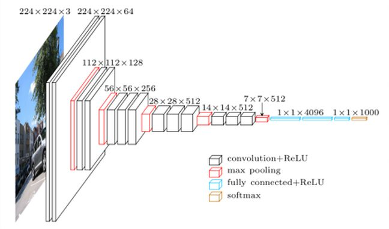

# Transfer Learning – ajout classifiers

* Je charge le modèle VGG16 sans la dernière couche
* Je lui ajoute mes propres couches de classifiers
  * 1 x 1024
  * 1 x 12

# Transfer Learning – entrainement total

optimizer=  'adam'

# Transfer Learning – poids fixes

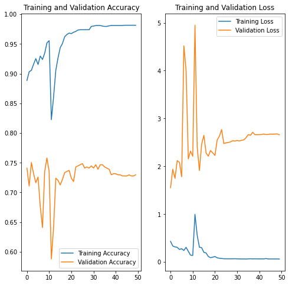

Je fixe les poids des premières couches

# Transfer Learning avec ResNet50

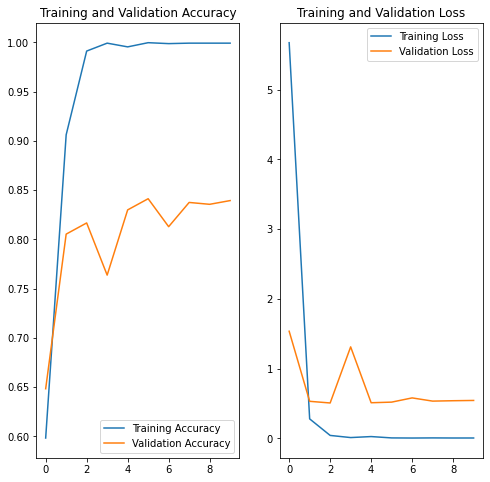

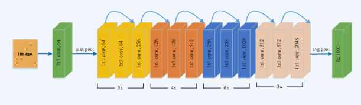

# Transfer Learning avec InceptionV3

« Factorisation »

«Depthwise Separable Convolutions »

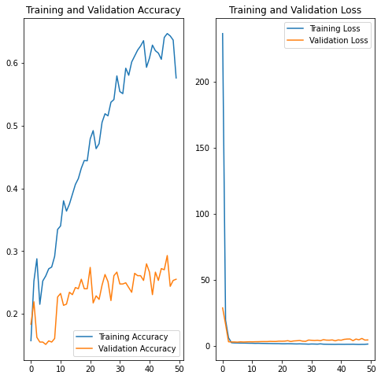

# Transfer Learning avec EfficientNet

# Optimisation des hyper-paramètres

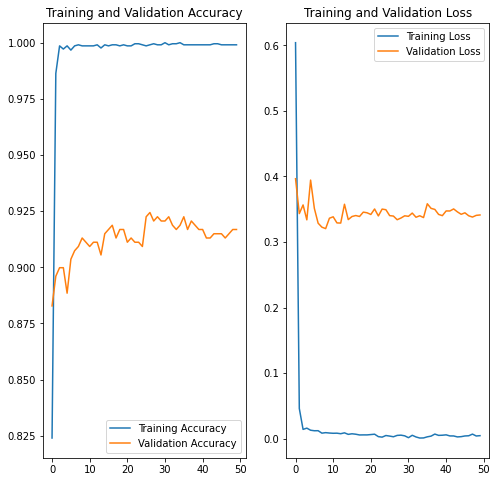

# Augmentation des données

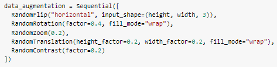

> 93% d’accuracy

# Passage en noir & blanc

# Equalization

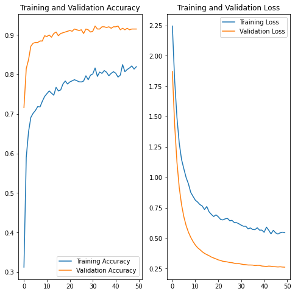

# Passage sur 120 classes

Au final, j’obtiens 81% d’accuracy sur le jeu de données complet, en utilisant les optimisations issues de mes tests sur 10% des classes.

Je sauvegarde les classes au format Pickle, et les poids du modèle au format h5.

# Utilisation du modèle

* J’ai réalisé un script qui :
  * Charge le modèle à partir de l’export
  * Charge les classes de prédictions
  * Traite l’image reçue en entrée
  * Réalise la prédiction
  * Sort les 3 premières races avec leurs taux de probabilité associés
  * 
* Utilisation en ligne de commande :

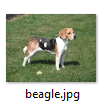

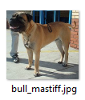

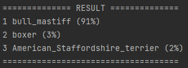

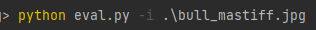

# Utilisation avec interface Gradio

J’ai utilisé la librairie de [Gradio](https://gradio.app/) permettant l’utilisation de mon modèle via une interface graphique dans le navigateur.

# Pistes d’amélioration

* Augmenter le nombre de photos, notamment pour les races qui se ressemblent (ex:English foxhound\, Walker hound & Beagle)

* Tester EfficientNetV2

[https://paperswithcode\.com/paper/efficientnetv2\-smaller\-models\-and\-faster](https://paperswithcode.com/paper/efficientnetv2-smaller-models-and-faster)

* Utiliser les Transformers à la place d’un CNN

[https://towardsdatascience\.com/are\-transformers\-better\-than\-cnns\-at\-image\-recognition\-ced60ccc7c8](https://towardsdatascience.com/are-transformers-better-than-cnns-at-image-recognition-ced60ccc7c8)

