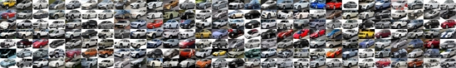

## Développez une preuve de concept

###10 JANVIER 2022

**Julien Gremillot**

# Introduction

## Un sujet : la classification d’images
Parmi les projets sur lesquels j’ai travaillé tout au long de ma formation, j’ai particulièrement apprécié celui ayant pour objet la classification d’images.

Lors de mon travail sur le sujet, en dressant l’état de l’art du domaine afin de sélectionner le meilleur modèle disponible, j’avais finalement utilisé le CNN « EfficientNet ».

Mais il m’est rapidement apparu qu’il existait depuis peu une alternative prometteuse aux CNN : les « Vision Transformers »

## Les Transformers

L’équipe Google Brain a introduit la notion de Transformers dans le NLP (Natural Language Processing – traitement du 
langage) en 2017 avec le papier « [Attention Is All You Need](https://arxiv.org/abs/1706.03762) ».

La notion d’« attention » dans une phrase consiste à calculer un poids pour chaque mot de la phrase en relation à chacun des autres mots.

C’est ce mécanisme qui a ensuite été adapté au [traitement des images](https://min.news/en/news/ee377ac7484178598b648e860039f447.html).

## Les Vision Transformers

Le premier article de recherche ayant placé cette idée sur le devant de la scène était
« [An Image is Worth 16x16 Words: Transformers for Image Recognition at Scale](https://arxiv.org/abs/2010.11929) », 
publié en octobre 2020.

Pour ce projet, j’ai également lu 
« [Tokens-to-Token ViT: Training Vision Transformers from Scratch on ImageNet](https://arxiv.org/abs/2101.11986) »
(janvier 2021) et surtout étudié le papier qui m’a servi de référence pour ce projet :
« [How to train your ViT? Data Augmentation and Regularization in Vision Transformers](https://arxiv.org/abs/2106.10270)
», publié en juin 2021.

# Sélection d’un dataset
## Stanford Dogs Dataset
Pour commencer, j’ai réalisé mes premiers tests avec le jeu de données déjà utilisé lors de mon 
travail sur le projet précédent 
« [Classez des images à l'aide d'algorithmes de Deep Learning](https://github.com/JulienGremillot/OpenClassrooms_Ingenieur_Machine_Learning/tree/main/P6%20-%20Classez%20des%20images%20%C3%A0%20l'aide%20d'algorithmes%20de%20Deep%20Learning) » : 
le [Stanford Dogs Dataset](http://vision.stanford.edu/aditya86/ImageNetDogs/).

Mais en travaillant avec des modèles pré-entrainés sur ImageNet, je me suis aperçu que les classes utilisées par ce jeu de données existaient déjà dans les classes ImageNet et en réalité, même en ne réalisant aucun « fine tuning » les modèles pré-entrainés étaient capables d’obtenir d’excellents scores de prédiction sur ce modèle.

## Stanford Cars Dataset
Après quelques recherches, j’ai opté pour un jeu de données très spécialisé pour lequel les 
classes ImageNet n’existaient pas : le
[Stanford Cars Dataset](https://ai.stanford.edu/~jkrause/cars/car_dataset.html).

Celui-ci semble plus difficile à appréhender que le *Dogs Dataset*, car il comporte moins 
d’images (16.185 contre 20.580) et plus de classes à prédire (196 contre 120).

Mais pour tester une architecture de Machine Learning prometteuse, autant choisir une tâche 
difficile!

# Création d’un Vision Transformer

Pour cette première expérience, je me suis beaucoup inspiré du tutoriel présent dans la 
documentation officielle Keras : « [Image classification with Vision Transformer](https://keras.io/examples/vision/image_classification_with_vision_transformer/) ». 

Le tutoriel utilisait le dataset [CIFAR-100](https://www.cs.toronto.edu/~kriz/cifar.html), 
composé de 100 classes avec 600 images par classe, d’un format de 32x32 pixels. 
Mes images sont d’une résolution supérieure, mais je dois m’attendre à des résultats moins 
bons puisque le *Cars Dataset* est composé de 196 classes avec une moyenne de 82 images 
par classe.

## Etapes de création du modèle
Ma démarche se décompose ainsi :

- Configuration des hyperparamètres
- Définition d’une augmentation de données
- Implémentation d’un perceptron multicouches (multilayer perceptron - MLP)
- Implémentation d’une couche « Patches » (surcharge de la classe Keras « Layer »)
  - Cette couche décompose l’image d’entrée en série de « patchs »
- Implémentation d’une couche « PatchEncoder »
  - Cette couche encode un « patch » en vecteur linéaire
- Construction du modèle ViT
- Compilation et entrainement du modèle
- Evaluation des performances du modèle

## Encodage des patchs

Le découpage des images en patchs se fait via les deux couches « Patches » et « PatchEncoder » de mon modèle.

Ci-dessous, le résultat obtenu sur une image redimensionnée au format 144x144, encodée en série de patchs de format 16x16. Chaque patch est l’équivalent d’un mot pour un modèle de NLP.

Cette série de patchs est remise en forme sous la forme d’un vecteur linéaire :

Ce vecteur est ensuite fourni en entrée des couches « Transformer ».

Les hyperparamètres me permettent de tester plusieurs formats d’images et de patchs 
afin d’observer les impacts sur les performances. 

## Architecture du modèle

- L'entrée accepte des images de format 144x144 sur 3 « channels » (les couleurs RGB).
- Le PatchEncoder renvoie un vecteur de 81 patchs de 768 éléments (16x16x3).
- J’ai découpé ici la zone des couches correspondant à une instance « Transformer », répétée plusieurs fois dans l’architecture finale du modèle.
- La dernière couche Dense comporte ici 10 sorties, mais dans un premier temps elle en comportait bien 196 correspondants aux classes à prédire. Cette architecture correspond à un test expliqué plus loin.

## Résultats obtenus

Avec des images de 32x32 et des patchs de 6x6 :

- Accuracy: 1.1%
- [Top 5 accuracy](https://towardsdatascience.com/accuracy-and-loss-things-to-know-about-the-top-1-and-top-5-accuracy-1d6beb8f6df3): 4.91%

En augmentant la taille des images de 72x72 :

- Accuracy: 0.98%
- Top 5 accuracy: 4.11%

En passant le nombre de couches Transformer de 8 à 16 ("transformer\_layers") :

- Accuracy: 1.04%
- Top 5 accuracy: 3.19%

Les premiers résultats avec une faible résolution sont les meilleurs, mais on peut tout de 
même conclure qu’une précision de 1.1% est très mauvaise.

Le notebook d’entrainement de cette première approche est disponible sur mon compte GitHub 
sous le nom « [Développez\_une\_preuve\_de\_concept\_1.ipynb](https://github.com/JulienGremillot/OpenClassrooms_Ingenieur_Machine_Learning/blob/main/P7%20-%20D%C3%A9veloppez%20une%20preuve%20de%20concept/D%C3%A9veloppez_une_preuve_de_concept_1.ipynb) »

Je rejoins donc ici l’une des conclusions du papier de recherche : 
on peut essayer d’améliorer les performances du modèle en augmentant la résolution des 
images ou le nombre de couches Transformer, mais en pratique il est recommandé de réaliser 
du « Fine-Tuning » à partir d’un modèle pré-entrainé à l’aide d’un grand jeu de données
à haute résolution.

C’est donc ce que je vais présenter dans le chapitre suivant.

# Fine-Tuning d’un Vision Transformer

## Librairies Hugging Face
Pour cette seconde approche, j’ai d’abord essayé d’utiliser directement les modèles mis à
disposition par l’équipe
[Google Brain sur GitHub](https://github.com/google-research/vision_transformer) mais des
difficultés de configuration m’ont conduit à préférer l’utilisation des librairies mises à 
disposition sur le site « [Hugging Face ](https://huggingface.co)».

J’ai utilisé la [documentation Hugging Face](https://huggingface.co/docs/transformers/index) 
et les articles 
« [How to Train a Custom Vision Transformer (ViT) Image Classifier to Help Endoscopists in Less than 5 min ](https://medium.com/@yanis.labrak/how-to-train-a-custom-vision-transformer-vit-image-classifier-to-help-endoscopists-in-under-5-min-2e7e4110a353) »
de Yanis Labrak et « [Image Classification using Huggingface ViT](https://medium.com/@kenjiteezhen/image-classification-using-huggingface-vit-261888bfa19f) » de Kenji Tee.

Mon code est sur Github dans le notebook
« [Développez\_une\_preuve\_de\_concept\_3.ipynb](https://github.com/JulienGremillot/OpenClassrooms_Ingenieur_Machine_Learning/blob/main/P7%20-%20D%C3%A9veloppez%20une%20preuve%20de%20concept/D%C3%A9veloppez_une_preuve_de_concept_3.ipynb) ».

Grâce aux objets mis à disposition, il m’a suffi de quelques lignes de code pour récupérer le 
modèle pré-entrainé « vit-base-patch16-224 » et obtenir une prédiction sur l’une des
images de mon jeu de données :

Bien sûr, la catégorie « sport car » correspond uniquement à l’une des catégories ImageNet,
il me reste à réaliser le fine-tuning.

## Premiers résultats

Pour ma première expérience, j’ai tout de même poursuivi avec ces paramètres et j’ai obtenu 
presque **70% d’accuracy** sur le jeu de validation.

En lançant des prédictions sur un lot de 25 images que le modèle n’avait jamais vu (hors des 
jeux train/val), celui-ci n’a donné que 11 bonnes réponses, soit 44% de précision.

Ce score est bien meilleur que celui obtenu avec mon modèle « from scratch », 
et meilleur que le même test que j’ai réalisé avec du [Transfer Learning depuis un CNN EfficientNet](https://github.com/JulienGremillot/OpenClassrooms_Ingenieur_Machine_Learning/blob/main/P7%20-%20D%C3%A9veloppez%20une%20preuve%20de%20concept/D%C3%A9veloppez_une_preuve_de_concept_4_efficientnet.ipynb)
(validation accuracy ~32% et 1 bonne réponse sur 25 sur le jeu de test),
mais j’ai bien sûr cherché différentes pistes d’amélioration.

## Equilibrage manuel des classes

J’ai rencontré un obstacle avec les paramètres conseillés lors de la division en jeux 
d’entrainement et de validation : la librairie propose d’équilibrer le nombre d’images 
par classe (« balanced=True »).

Or, la classe la moins représentée comportant seulement 48 images, il ne restait que 9.408 
images utilisables… En gardant 20% pour le jeu de validation, on se retrouvait avec 38 images 
par classe !

J’ai tout d’abord essayé de conserver plus d’images pour entrainer mon modèle. 
Sur les 196 classes, représentées avec un nombre de photos allant de 48 à 136, 
seules 7 en comptaient moins de 64. En désactivant l’équilibrage automatique lors de 
la constitution des jeux de données (« balanced=False ») et en conservant 64 
images par classe, je restais proche de l’équilibre et obtenais 25% de données supplémentaires.

Cet ajustement m’a permis d’obtenir **76% d’accuracy** sur le jeu de validation.

## Réduction du nombre de classes

J’ai ensuite cherché à réduire la difficulté de prédiction en réduisant le nombre de 
classes à 10. Pour rendre l’entraînement plus efficace, j’ai bien sûr sélectionné les 
classes pour lesquelles je disposais du plus grand nombre de photos : entre 92 et 136.
J’ai remis en place l’équilibrage, me permettant de disposer de 92 images par classe.

Sur cette tâche plus simple, j’ai obtenu **91% d’accuracy** sur le jeu de validation.

Finalement, ce modèle obtient 80% de réussite (8 sur 10) sur mes photos mises de côté :

Le notebook correspondant est sur GitHub : « [Développez\_une\_preuve\_de\_concept\_3b.ipynb](https://github.com/JulienGremillot/OpenClassrooms_Ingenieur_Machine_Learning/blob/main/P7%20-%20D%C3%A9veloppez%20une%20preuve%20de%20concept/D%C3%A9veloppez_une_preuve_de_concept_3b.ipynb) ».

## Nouveaux tests sur le modèle « from scratch »

Avec ce jeu de données réduit, j’ai voulu comparer les améliorations que je pouvais obtenir sur
le premier modèle développé.

Avec des images de 72x72 et des patchs de 6x6 j'ai obtenu une accuracy de 21.43% 
(top 5 accuracy : 67.35%). Cette fois, l’augmentation de la taille des patchs à 8x8 m’a
donné une amélioration significative, avec une **accuracy de 24.49%** (top 5 accuracy: 71.43%).
Mais en doublant la taille des images à 144x144 et celle des patchs à 16x16, le score était 
moins bon (accuracy: 20.92%).

Notebook sur GitHub sous le nom 
« [Développez\_une\_preuve\_de\_concept\_1b.ipynb](https://github.com/JulienGremillot/OpenClassrooms_Ingenieur_Machine_Learning/blob/main/P7%20-%20D%C3%A9veloppez%20une%20preuve%20de%20concept/D%C3%A9veloppez_une_preuve_de_concept_1b.ipynb) »

# Conclusions

Même si je m’attendais à obtenir des résultats encore meilleurs, je dois admettre que les 
performances du fine-tuning d’un modèle de Vision Transformer pré-entrainé sont très 
impressionnantes.

D’une part, mes résultats sont à confronter avec la difficulté de la tâche : même en
réduisant mon nombre de classes de sortie, je ne disposais que de 92 images par classe 
pour réaliser l’entraînement de mon modèle final.

D’autre part, ce fine-tuning s’est réalisé relativement rapidement, en tout cas vis-à-vis 
de mes expériences précédentes sur du Transfer Learning de modèle CNN. 
L’architecture « Transformer » permet de paralléliser les calculs et accélère 
significativement les traitements.

Enfin, j’ai été séduit par la simplicité d’utilisation de la librairie Hugging Face. 
Leur [base de 25.179 modèles](https://huggingface.co/models) (à l’heure où je rédige ce rapport) 
est très fournie, et je me tournerai certainement vers ce site pour des futurs projets.

## Perspectives

Les Vision Transformers ont le vent en poupe : Facebook s’attache à les adapter au traitement
des vidéos avec la méthode des
« [Divided Space-Time Attention ](https://arxiv.org/abs/2102.05095) » 
et a introduit l’architecture
« [Multiscale Vision Transformers ](https://ai.facebook.com/blog/multiscale-vision-transformers-an-architecture-for-modeling-visual-data/) »
en août 2021.

[L’un des meilleurs kernels public](https://www.kaggle.com/stefanojp/clean-petfinder-fastai-kf-10-mixup-the-best)
de la compétition Kaggle à laquelle j’ai participé pour cette formation utilise un modèle 
mixte basé sur un « [Swin Transformer ](https://arxiv.org/abs/2103.14030) », dont la référence est une publication 
d’août dernier elle aussi.

C’est donc un domaine très actif, et j’espère bien pouvoir suivre ses avancées et les utiliser 
dans un futur proche !
