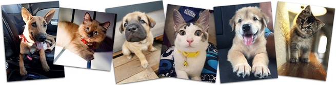
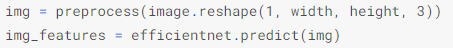

# Participez à une compétition Kaggle !

*Julien Gremillot*

*Parcours OpenClassrooms Ingénieur Machine Learning*

*Décembre 2021*

## INSTRUCTIONS

Ce projet consiste à participer à une compétition organisée par
 [Kaggle](https://en.wikipedia.org/wiki/Kaggle), une plateforme qui organise 
des compétitions en data science et qui récompense les meilleurs analystes internationaux.

J’ai choisi de participer à une compétition proposée par PetFinder.my,
la société protectrice des animaux en Malaisie.
Ce site utilise un « cuteness meter » pour mesurer et classer des photos 
d’animaux de compagnie afin de mettre en avant celles où l’animal est le plus « mignon ».

Le concours consiste à prédire la note correspondant à une photo d’animal,
permettant ainsi d’automatiser la sélection des meilleures photos à mettre en avant pour favoriser
l’adoption des animaux.

## Récupération des données

Les données fournies par Kaggle sont de 2 types :

- Un répertoire contenant des photos d’animaux
- Un fichier CSV dont chaque ligne correspond à une photo et qui lui associe un certain nombre d’informations dont la note de « Pawpularity » (le score que l’on cherche à prédire).

Outre la note, les informations du tableau de données – que l’on appellera aussi « métadatas » - consistent en des informations binaires (0 ou 1, soit « vrai » ou « faux ») sur certaines caractéristiques de la photo : netteté du sujet, si on voit ses yeux, s’il est en action, accompagné d’un humain, d’un jouet, etc.

## Analyse exploratoire

En examinant les métadatas, on constate qu’elles sont peu corrélées entre elles, 
et surtout qu’aucune ne semble particulièrement corrélée au score de Pawpularity.

Répartition du score de Pawpularity :

De cette première exploration, j’ai relevé plusieurs informations :

- Le dataset compte 9885 images
- La note moyenne est de 38
- Les notes de pawpularity s’échelonnent de 1 à 100
- Pour chaque note, on a quelques dizaines d’images

Dans un premier temps, l’objectif de prédiction d’une note m’a fait travailler sur un problème de Régression, mais dans un second temps, j’ai réalisé que les données pouvaient également permettre de traiter le problème comme une classification vers 100 classes correspondant aux 100 notes possibles.

Nous verrons ci-après les résultats de ces différentes approches.

## Création des modèles

### Régression avec un modèle CNN basé sur les images

J’ai commencé par utiliser les images pour alimenter un réseau de neurones et prédire
la note finale en fonction de l’image en entrée.

J’ai donc utilisé le modèle EfficientNet, qui m’avait donné les meilleurs résultats lorsque
j’avais étudié le Transfer Learning sur le projet de prédiction de races de chiens. 
Puisque nous avons également ici des photos d’animaux de compagnie, les entrées semblaient
relativement ressemblantes.

J’ai utilisé la classe ImageDataGenerator pour traiter les images en entrée et réaliser 
une augmentation de données.

Cette classe me permettait également de ne pas avoir à charger en mémoire toutes les images, 
qui pouvaient être traitées par batchs à l’aide de la méthode « flow_from_dataframe ».

Puisque les notebooks Kaggle proposés à la soumission pour ce concours ne devaient pas utiliser 
d’accès internet, j’ai utilisé un dataset partagé permettant de récupérer l’architecture et 
les poids associés au modèle EfficientNet que je souhaitais utiliser pour mon Transfer Learning.

J’ai ajouté mes couches de sorties, en terminant par une couche entièrement connectée avec
une seule sortie : la prédiction de score de pawpularity.

En me basant sur la valeur moyenne du pourcentage d’erreur absolue (« MAPE »), 
l’entrainement de mon modèle descend à 58% (sur le jeu de validation) avant d’être interrompu :

En testant les prédictions du modèle avec quelques images de mon lot de test,
j’obtiens des résultats très versatiles :

Les prédictions sur les images de test donnent des résultats incongrus (entre -16000 et -500), 
mais quand j’examine les images fournies, je me dis que c’est peut-être normal :

Je décide donc d’envoyer tout de même ma première soumission… et je me positionne avant-dernier
du classement !

### 2e régression avec un CNN basé sur les images

En réalité, j’avais encore une erreur dans l’algorithme utilisé pour mes prédictions 
finales : le pre-processing des images envoyées au modèle n’était pas complet.

Pour ma deuxième expérience, j’ai donc corrigé ce problème et j’ai décidé d’améliorer 
mes prédictions en passant à une version plus récente du modèle de base : EfficientNetV2

J’ai en effet trouvé sur Kaggle des « data sources » qui mettent à disposition ce modèle
considéré comme l’un des plus performant actuellement pour la classification d’images.

En effet, j’obtiens une MAPE légèrement meilleure, puisqu’elle descend à 56% sur le 
jeu de validation :

Cette fois, les prédictions sur les images de test sont beaucoup plus cohérentes,
et mon score public sur cette soumission passe à 23.68, ce qui me permet de remonter 
au classement même si je suis toujours dans les derniers 10% (environ 2900e sur 3100).

### Régression sur métadatas et features des images

Jusqu’ici je n’ai utilisé que les images du jeu de données. 
Je cherche donc pour cette 3e approche à utiliser également les 12 colonnes de métadatas
« binaires » mises à disposition.

J’utilise donc le modèle EfficientNetV2 auquel je n’ai pas ajouté de couches de sortie,
mais je stocke le vecteur obtenu en sortie.

J’obtiens un vecteur au format (7, 7, 1.280) soit 62.720 features supplémentaires.

Ajoutées aux métadatas initiales, c’est donc un dataframe de 62.732 colonnes que je vais
devoir traiter. C’est beaucoup, et même trop pour les capacités de mémoire mises à disposition
sur Kaggle. Je cherche donc à reduire le nombre de features.

Pour cela, j’ai utilisé des matrices de corrélation. L’idéal aurait été d’utiliser une 
seule matrice de corrélation, mais encore une fois le grand nombre de colonnes m’a obligé 
à découper le traitement, et de calculer les corrélations sur des sous-ensembles de 5.000
colonnes successifs.

J’ai fixé une limite à 80% de corrélation, au-delà de laquelle je considère que la colonne 
peut être supprimée.

Après 2 passes sur ces boucles de corrélations, j’ai réussi à réduire le nombre de colonnes à 37.093

Il ne me restait plus qu’à découper mon dataframe en jeux d’entrainement et de validation pour 
pouvoir entraîner mon modèle.

J’ai utilisé différents types de Regressors pour entraîner mon modèle :

- GradientBoostingRegressor
- XGBoost
- CatBoost
- LightGBM

J’ai également fait un test avec le RandomForestRegressor, mais il n’a pas réussi à aboutir.

Les différents modèles ont obtenus des résultats pratiquement identiques, le plus rapide étant
le XGBoost, qui a réalisé des prédictions sur le jeu de validation avec une RMSE
(root mean squared error) de 22.52. C’est ce modèle que j’ai finalement utilisé pour réaliser 
ma proposition.

Malheureusement après soumission de ce notebook, j’ai obtenu un score de 44.80, ce qui 
n’a pas amélioré mon classement pour cette compétition.

### Régression avec métadatas uniquement

A ce stade, j’ai réalisé que si j’avais essayé de faire mes prédictions de score uniquement 
avec les images, je n’avais pas encore testé les performances que l’on pouvait obtenir en 
utilisant uniquement les métadatas.

J’ai donc réalisé un notebook beaucoup plus simple que les précédents, où j’ai chargé le CSV 
et supprimé la colonne mentionnant les images associées à chaque ligne.

J’ai testé plusieurs types de modèles et utilisé un GridSearchCV pour optimiser leurs paramètres.

Au final, j’ai effectué des prédictions à l’aide d’un modèle de type CatBoostRegressor, 
qui obtenait sur mes données de test un score RMSE de 20.48.

Après soumission, j’ai obtenu exactement le même score RMSE de 20.48, ce qui a constitué 
mon meilleur score depuis mes différentes expériences !

### Régression avec métadatas et colonnes RGB

Pour enrichir mon tableau de données sans utiliser de CNN pour générer des features, 
j’ai cherché à ajouter des colonnes au Dataframe initial, en tirant des informations des images.

Pour ça, j’ai chargé chaque image et calculé la moyenne des valeurs RGB de chaque pixel 
composant cette image.

Malheureusement les quelques heures de calcul nécessaire à extraire ces moyennes pour 
chaque image n’auront pas servies à grand-chose car j’ai obtenu sur mon jeu de test 
précisément le même score que sans ces nouvelles colonnes : un RMSE de 20.48 !

### Classification images & régression « métadatas »

Comme envisagé précédemment, j’ai voulu tester ce que l’on pouvait obtenir en considérant 
les notes de 1 à 100 comme 100 classes de prédiction différentes.

De la même façon que mes prédictions de regression, j’ai utilisé du Transfer Learning sur 
la base du modèle EfficientNetV2.

Le pourcentage d’accuracy obtenu avec mes premiers tests étaient très mauvais (environ 2%). 
J’ai donc commencé à réduire le nombre de classes à prédire en regroupant les notes successives.

Avec 50 classes, l’accuracy montait à 6.5%

Avec 10 classes, l’accuracy montait à 28% 

Enfin avec 5 classes, l’accuracy montait à 52%.

Mes classes finales regroupaient donc les notes de 1 à 20, de 21 à 40, …

J’ai donc réalisé des prédictions de classes sur chaque image du jeu de test et réalisé 
une pondération de la régression obtenue précédemment sur les métadatas avec le CatBoost.

Pour ne pas trop diverger des scores précédents, j’ai imputé une pondération égale au quart
de la différence avec la borne la plus proche de la classe (et aucune pondération si la note
était dans l’intervalle de la classe).

Exemple : un score de 37 obtenu par la régression associé à une classification vers la
classe 0-20 me donne un score final de prédiction de 37 – (37-20) / 4, soit 33 au final.

Ma soumission a finalement obtenu un score de RMSE de 20.50, ce qui est légèrement moins 
bon que le précedent meilleur score.

## Code & communauté Kaggle

### Versionning de mes notebooks

Au fil des mes différents tests, j’ai utilisé plusieurs notebooks et différentes versions 
pour chacun de ces notebooks.

J’avais commencé à versionner quelques notebooks réalisés en local sur mon poste sur GitHub :
<https://github.com/JulienGremillot/OpenClassrooms_Ingenieur_Machine_Learning/tree/main/P8%20-%20Participez%20%C3%A0%20une%20comp%C3%A9tition%20Kaggle>

Et au fur et à mesure de mes tests sur la plateforme Kaggle, j’ai remarqué que le site proposait une sauvegarde externe en liant mon compte vers Github. Cette fonctionnalité m’a permis de réaliser des versionning réguliers sur Github tout en testant mes différents notebooks sur Kaggle.

### Notebooks Kaggle publics intéressants

J’ai parcouru plusieurs notebooks partagés par leurs auteurs :

- [CNN regression, last attempt](https://www.kaggle.com/ingloriamori/cnn-regression-last-attempt) : ce notebook était intéressant car l’auteur a utilisé un CNN « from scratch » sans essayer de faire du Transfer Learning, et a obtenu un score très honorable de 20.31 en utilisant uniquement les images.
- [XGBoost model on Metadata](https://www.kaggle.com/santhoshkumarv/xgboost-model-on-metadata/) : celui-ci a choisi l’option « métadatas uniquement » et a obtenu un score de 20.52, ce qui est légèrement moins bon que mon score obtenu avec le modèle CatBoost.
- [Clean Petfinder& fastai KF 10 Mixup - The best](https://www.kaggle.com/stefanojp/clean-petfinder-fastai-kf-10-mixup-the-best) : l’un des meilleurs scores obtenus par un Kernel public avec 17.86. Celui-ci n’utilise pas un CNN mais un Vision Transformer, et même pour être précis un « Swin Transformer » issu d’un [papier publié en août 2021](https://arxiv.org/abs/2103.14030). Il utilise les metadatas et les images. Je pense qu’il serait très intéressant de reprendre ce notebook pour essayer de reproduire son score.

### **Partage avec la communauté Kaggle**

Même s’il ne m’a pas permis d’obtenir un meilleur score que la régression simple, j’ai trouvé mon idée de pondération avec une classification intéressante à partager avec la communauté.

C’est donc ce « Kernel » que j’ai choisi de rendre public à l’adresse suivante :

<https://www.kaggle.com/juliengre/pawpularity-testing-classification-regression>

Pour communiquer avec d’autres participants, j’ai également partagé mon notebook « metadatas uniquement » et laissé un message à l’auteur du Kernel ressemblant mais utilisant XGBoost.

## Conclusion

Pour une première participation à une compétition Kaggle, je peux dire que cette expérience a été
très enrichissante.

D’une part, elle m’a permis d’enrichir mes connaissances des CNNs en utilisant pour la première 
fois le modèle EfficientNetV2, mais surtout en apprenant à chercher et utiliser ce modèle de façon
autonome.

D’autre part, elle m’a permis de « réviser » ce que j’avais pu apprendre au début de ma
formation concernant les Regressors (et d’en tester de nouveaux : Catboost, LightGBM), 
le GridSearchCV, …

Enfin, même si mon implémentation ne m’a pas fait obtenir un meilleur score, j’ai pu voir 
dans les notebooks partagés par d’autres que le fait de mixer deux types de modèles - 
l’un permettant de réaliser du « feature engineering » pour alimenter l’autre - 
peut permettre d’atteindre des performances supérieures.

## Annexes

### Annexe 1 – Liste de mes soumissions au concours

### Annexe 2 – Liens de mes Kernels

[pawpularity regression w metadata first](https://www.kaggle.com/juliengre/pawpularity-regression-w-metadata-first)
Score: 20.48466

[pawpularity testing classification + regression](https://www.kaggle.com/juliengre/pawpularity-testing-classification-regression)
Score: 20.50171 

[pawpularity-score efficientnet feature engineering](https://www.kaggle.com/juliengre/pawpularity-score-efficientnet-feature-engineering)
Score: 23.68214

[using pawpularity features 3](https://www.kaggle.com/juliengre/using-pawpularity-features-3)
Score: 44.80866

[pawpularity classification grouped](https://www.kaggle.com/juliengre/pawpularity-classification-grouped)

[using pawpularity features 2](https://www.kaggle.com/juliengre/using-pawpularity-features-2)

[pawpularity-score efficientnetV2 total FE](https://www.kaggle.com/juliengre/pawpularity-score-efficientnetv2-total-fe)

Mon classement à ce concours est actuellement 2302e sur 3188, les résultats définitifs 
seront connus le 15 janvier 2022.

Participez à une compétition Kaggle ! - Julien Gremillot 2021